```mermaid
flowchart TB
    subgraph upstream["Dependants (2)"]
        P1["<b>📦&nbsp;ReadableWeb.csproj</b><br/><small>net10.0</small>"]
        P3["<b>📦&nbsp;ReadableWeb.HtmlAgilityPack.csproj</b><br/><small>net10.0</small>"]
        click P1 "#readablewebreadablewebcsproj"
        click P3 "#readablewebhtmlagilitypackreadablewebhtmlagilitypackcsproj"
    end
    subgraph current["ReadableWeb.Abstractions.csproj"]
        MAIN["<b>📦&nbsp;ReadableWeb.Abstractions.csproj</b><br/><small>net10.0</small>"]
        click MAIN "#readablewebabstractionsreadablewebabstractionscsproj"
    end
    P1 --> MAIN
    P3 --> MAIN

```

```mermaid
flowchart TB
    subgraph upstream["Dependants (2)"]
        P1["<b>📦&nbsp;ReadableWeb.csproj</b><br/><small>net10.0</small>"]
        P4["<b>📦&nbsp;ReadableWeb.Tests.csproj</b><br/><small>net10.0</small>"]
        click P1 "#readablewebreadablewebcsproj"
        click P4 "#readablewebtestsreadablewebtestscsproj"
    end
    subgraph current["ReadableWeb.HtmlAgilityPack.csproj"]
        MAIN["<b>📦&nbsp;ReadableWeb.HtmlAgilityPack.csproj</b><br/><small>net10.0</small>"]
        click MAIN "#readablewebhtmlagilitypackreadablewebhtmlagilitypackcsproj"
    end
    subgraph downstream["Dependencies (1"]
        P2["<b>📦&nbsp;ReadableWeb.Abstractions.csproj</b><br/><small>net10.0</small>"]
        click P2 "#readablewebabstractionsreadablewebabstractionscsproj"
    end
    P1 --> MAIN
    P4 --> MAIN
    MAIN --> P2

```

```mermaid
flowchart TB
    subgraph current["ReadableWeb.Tests.csproj"]
        MAIN["<b>📦&nbsp;ReadableWeb.Tests.csproj</b><br/><small>net10.0</small>"]
        click MAIN "#readablewebtestsreadablewebtestscsproj"
    end
    subgraph downstream["Dependencies (2"]
        P1["<b>📦&nbsp;ReadableWeb.csproj</b><br/><small>net10.0</small>"]
        P3["<b>📦&nbsp;ReadableWeb.HtmlAgilityPack.csproj</b><br/><small>net10.0</small>"]
        click P1 "#readablewebreadablewebcsproj"
        click P3 "#readablewebhtmlagilitypackreadablewebhtmlagilitypackcsproj"
    end
    MAIN --> P1
    MAIN --> P3

```

```mermaid
flowchart TB
    subgraph upstream["Dependants (1)"]
        P4["<b>📦&nbsp;ReadableWeb.Tests.csproj</b><br/><small>net10.0</small>"]
        click P4 "#readablewebtestsreadablewebtestscsproj"
    end
    subgraph current["ReadableWeb.csproj"]
        MAIN["<b>📦&nbsp;ReadableWeb.csproj</b><br/><small>net10.0</small>"]
        click MAIN "#readablewebreadablewebcsproj"
    end
    subgraph downstream["Dependencies (2"]
        P2["<b>📦&nbsp;ReadableWeb.Abstractions.csproj</b><br/><small>net10.0</small>"]
        P3["<b>📦&nbsp;ReadableWeb.HtmlAgilityPack.csproj</b><br/><small>net10.0</small>"]
        click P2 "#readablewebabstractionsreadablewebabstractionscsproj"
        click P3 "#readablewebhtmlagilitypackreadablewebhtmlagilitypackcsproj"
    end
    P4 --> MAIN
    MAIN --> P2
    MAIN --> P3

```

# Projects and dependencies analysis

This document provides a comprehensive overview of the projects and their dependencies in the context of upgrading to .NETCoreApp,Version=v10.0.

## Table of Contents

- [Executive Summary](#executive-Summary)
  - [Highlevel Metrics](#highlevel-metrics)
  - [Projects Compatibility](#projects-compatibility)
  - [Package Compatibility](#package-compatibility)
  - [API Compatibility](#api-compatibility)
- [Aggregate NuGet packages details](#aggregate-nuget-packages-details)
- [Top API Migration Challenges](#top-api-migration-challenges)
  - [Technologies and Features](#technologies-and-features)
  - [Most Frequent API Issues](#most-frequent-api-issues)
- [Projects Relationship Graph](#projects-relationship-graph)
- [Project Details](#project-details)

  - [ReadableWeb.Abstractions\ReadableWeb.Abstractions.csproj](#readablewebabstractionsreadablewebabstractionscsproj)
  - [ReadableWeb.HtmlAgilityPack\ReadableWeb.HtmlAgilityPack.csproj](#readablewebhtmlagilitypackreadablewebhtmlagilitypackcsproj)
  - [ReadableWeb.Tests\ReadableWeb.Tests.csproj](#readablewebtestsreadablewebtestscsproj)
  - [ReadableWeb\ReadableWeb.csproj](#readablewebreadablewebcsproj)

## Executive Summary

### Highlevel Metrics

| Metric | Count | Status |
| :--- | :---: | :--- |
| Total Projects | 4 | 0 require upgrade |
| Total NuGet Packages | 13 | All compatible |
| Total Code Files | 28 |  |
| Total Code Files with Incidents | 0 |  |
| Total Lines of Code | 2270 |  |
| Total Number of Issues | 0 |  |
| Estimated LOC to modify | 0+ | at least 0.0% of codebase |

### Projects Compatibility

| Project | Target Framework | Difficulty | Package Issues | API Issues | Est. LOC Impact | Description |
| :--- | :---: | :---: | :---: | :---: | :---: | :--- |
| [ReadableWeb.Abstractions\ReadableWeb.Abstractions.csproj](#readablewebabstractionsreadablewebabstractionscsproj) | net10.0 | ✅ None | 0 | 0 |  | ClassLibrary, Sdk Style = True |
| [ReadableWeb.HtmlAgilityPack\ReadableWeb.HtmlAgilityPack.csproj](#readablewebhtmlagilitypackreadablewebhtmlagilitypackcsproj) | net10.0 | ✅ None | 0 | 0 |  | ClassLibrary, Sdk Style = True |
| [ReadableWeb.Tests\ReadableWeb.Tests.csproj](#readablewebtestsreadablewebtestscsproj) | net10.0 | ✅ None | 0 | 0 |  | DotNetCoreApp, Sdk Style = True |
| [ReadableWeb\ReadableWeb.csproj](#readablewebreadablewebcsproj) | net10.0 | ✅ None | 0 | 0 |  | ClassLibrary, Sdk Style = True |

### Package Compatibility

| Status | Count | Percentage |
| :--- | :---: | :---: |
| ✅ Compatible | 13 | 100.0% |
| ⚠️ Incompatible | 0 | 0.0% |
| 🔄 Upgrade Recommended | 0 | 0.0% |
| ***Total NuGet Packages*** | ***13*** | ***100%*** |

### API Compatibility

| Category | Count | Impact |
| :--- | :---: | :--- |
| 🔴 Binary Incompatible | 0 | High - Require code changes |
| 🟡 Source Incompatible | 0 | Medium - Needs re-compilation and potential conflicting API error fixing |
| 🔵 Behavioral change | 0 | Low - Behavioral changes that may require testing at runtime |
| ✅ Compatible | 0 |  |
| ***Total APIs Analyzed*** | ***0*** |  |

## Aggregate NuGet packages details

| Package | Current Version | Suggested Version | Projects | Description |
| :--- | :---: | :---: | :--- | :--- |
| HtmlAgilityPack | 1.12.4 |  | [ReadableWeb.HtmlAgilityPack.csproj](#readablewebhtmlagilitypackreadablewebhtmlagilitypackcsproj) | ✅Compatible |
| Microsoft.Extensions.Configuration.Abstractions | 10.0.1 |  | [ReadableWeb.csproj](#readablewebreadablewebcsproj) | ✅Compatible |
| Microsoft.Extensions.Configuration.Binder | 10.0.1 |  | [ReadableWeb.csproj](#readablewebreadablewebcsproj) | ✅Compatible |
| Microsoft.Extensions.DependencyInjection | 10.0.1 |  | [ReadableWeb.csproj](#readablewebreadablewebcsproj) | ✅Compatible |
| Microsoft.Extensions.DependencyInjection.Abstractions | 10.0.1 |  | [ReadableWeb.csproj](#readablewebreadablewebcsproj) [ReadableWeb.HtmlAgilityPack.csproj](#readablewebhtmlagilitypackreadablewebhtmlagilitypackcsproj) | ✅Compatible |
| Microsoft.Extensions.Http | 10.0.1 |  | [ReadableWeb.csproj](#readablewebreadablewebcsproj) | ✅Compatible |
| Microsoft.Extensions.Logging.Abstractions | 10.0.1 |  | [ReadableWeb.csproj](#readablewebreadablewebcsproj) | ✅Compatible |
| Microsoft.NET.Test.Sdk | 18.0.1 |  | [ReadableWeb.Tests.csproj](#readablewebtestsreadablewebtestscsproj) | ✅Compatible |
| Shouldly | 4.3.0 |  | [ReadableWeb.Tests.csproj](#readablewebtestsreadablewebtestscsproj) | ✅Compatible |
| StackExchange.Redis | 2.10.1 |  | [ReadableWeb.csproj](#readablewebreadablewebcsproj) | ✅Compatible |
| Validated.Primitives | 1.1.67 |  | [ReadableWeb.csproj](#readablewebreadablewebcsproj) | ✅Compatible |
| xunit | 2.9.3 |  | [ReadableWeb.Tests.csproj](#readablewebtestsreadablewebtestscsproj) | ✅Compatible |
| xunit.runner.visualstudio | 3.1.5 |  | [ReadableWeb.Tests.csproj](#readablewebtestsreadablewebtestscsproj) | ✅Compatible |

## Top API Migration Challenges

### Technologies and Features

| Technology | Issues | Percentage | Migration Path |
| :--- | :---: | :---: | :--- |

### Most Frequent API Issues

| API | Count | Percentage | Category |
| :--- | :---: | :---: | :--- |

## Projects Relationship Graph

Legend:
📦 SDK-style project
⚙️ Classic project

```mermaid
flowchart LR
    P1["<b>📦&nbsp;ReadableWeb.csproj</b><br/><small>net10.0</small>"]
    P2["<b>📦&nbsp;ReadableWeb.Abstractions.csproj</b><br/><small>net10.0</small>"]
    P3["<b>📦&nbsp;ReadableWeb.HtmlAgilityPack.csproj</b><br/><small>net10.0</small>"]
    P4["<b>📦&nbsp;ReadableWeb.Tests.csproj</b><br/><small>net10.0</small>"]
    P1 --> P2
    P1 --> P3
    P3 --> P2
    P4 --> P1
    P4 --> P3
    click P1 "#readablewebreadablewebcsproj"
    click P2 "#readablewebabstractionsreadablewebabstractionscsproj"
    click P3 "#readablewebhtmlagilitypackreadablewebhtmlagilitypackcsproj"
    click P4 "#readablewebtestsreadablewebtestscsproj"

```

## Project Details

### ReadableWeb.Abstractions\ReadableWeb.Abstractions.csproj

#### Project Info

- **Current Target Framework:** net10.0✅
- **SDK-style**: True
- **Project Kind:** ClassLibrary
- **Dependencies**: 0
- **Dependants**: 2
- **Number of Files**: 9
- **Lines of Code**: 106
- **Estimated LOC to modify**: 0+ (at least 0.0% of the project)

#### Dependency Graph

Legend:
📦 SDK-style project
⚙️ Classic project

### API Compatibility

| Category | Count | Impact |
| :--- | :---: | :--- |
| 🔴 Binary Incompatible | 0 | High - Require code changes |
| 🟡 Source Incompatible | 0 | Medium - Needs re-compilation and potential conflicting API error fixing |
| 🔵 Behavioral change | 0 | Low - Behavioral changes that may require testing at runtime |
| ✅ Compatible | 0 |  |
| ***Total APIs Analyzed*** | ***0*** |  |

### ReadableWeb.HtmlAgilityPack\ReadableWeb.HtmlAgilityPack.csproj

#### Project Info

- **Current Target Framework:** net10.0✅
- **SDK-style**: True
- **Project Kind:** ClassLibrary
- **Dependencies**: 1
- **Dependants**: 2
- **Number of Files**: 7
- **Lines of Code**: 1116
- **Estimated LOC to modify**: 0+ (at least 0.0% of the project)

#### Dependency Graph

Legend:
📦 SDK-style project
⚙️ Classic project

### API Compatibility

| Category | Count | Impact |
| :--- | :---: | :--- |
| 🔴 Binary Incompatible | 0 | High - Require code changes |
| 🟡 Source Incompatible | 0 | Medium - Needs re-compilation and potential conflicting API error fixing |
| 🔵 Behavioral change | 0 | Low - Behavioral changes that may require testing at runtime |
| ✅ Compatible | 0 |  |
| ***Total APIs Analyzed*** | ***0*** |  |

### ReadableWeb.Tests\ReadableWeb.Tests.csproj

#### Project Info

- **Current Target Framework:** net10.0✅
- **SDK-style**: True
- **Project Kind:** DotNetCoreApp
- **Dependencies**: 2
- **Dependants**: 0
- **Number of Files**: 5
- **Lines of Code**: 310
- **Estimated LOC to modify**: 0+ (at least 0.0% of the project)

#### Dependency Graph

Legend:
📦 SDK-style project
⚙️ Classic project

### API Compatibility

| Category | Count | Impact |
| :--- | :---: | :--- |
| 🔴 Binary Incompatible | 0 | High - Require code changes |
| 🟡 Source Incompatible | 0 | Medium - Needs re-compilation and potential conflicting API error fixing |
| 🔵 Behavioral change | 0 | Low - Behavioral changes that may require testing at runtime |
| ✅ Compatible | 0 |  |
| ***Total APIs Analyzed*** | ***0*** |  |

### ReadableWeb\ReadableWeb.csproj

#### Project Info

- **Current Target Framework:** net10.0✅
- **SDK-style**: True
- **Project Kind:** ClassLibrary
- **Dependencies**: 2
- **Dependants**: 1
- **Number of Files**: 9
- **Lines of Code**: 738
- **Estimated LOC to modify**: 0+ (at least 0.0% of the project)

#### Dependency Graph

Legend:
📦 SDK-style project
⚙️ Classic project

### API Compatibility

| Category | Count | Impact |
| :--- | :---: | :--- |
| 🔴 Binary Incompatible | 0 | High - Require code changes |
| 🟡 Source Incompatible | 0 | Medium - Needs re-compilation and potential conflicting API error fixing |
| 🔵 Behavioral change | 0 | Low - Behavioral changes that may require testing at runtime |
| ✅ Compatible | 0 |  |
| ***Total APIs Analyzed*** | ***0*** |  |

